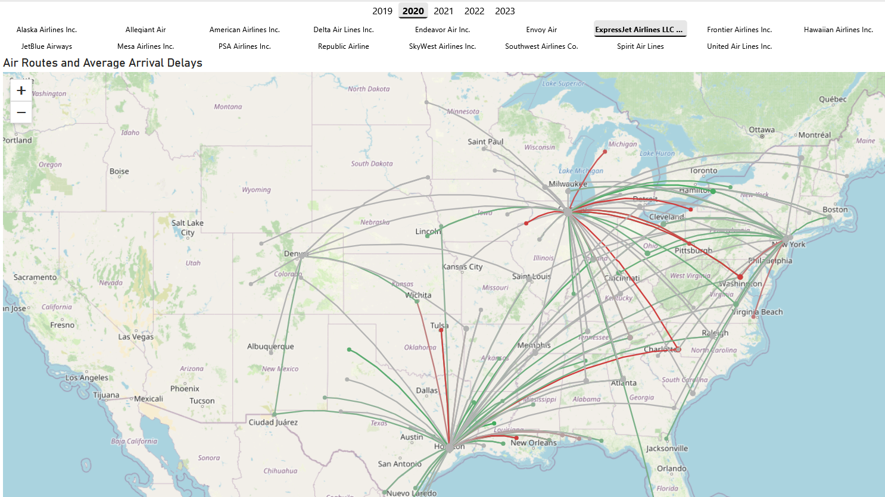

# Route Map – Power BI Custom Visual


A lightweight, interactive Power BI custom visual for visualizing origin-destination routes on a map. Perfect for
logistics analysis, flight routes, supply chains, migration patterns, and any data showing movement between geographic
locations.

This project is a scaled-down, simplified version based
on [Lytiqa/PowerBI-visuals-Route-Map](https://github.com/Lytiqa/PowerBI-visuals-Route-Map)
from [John Hagelin](https://github.com/Fruktkorg). Many thanks to him for open-sourcing his work!



---

## Features

### Core Capabilities

- **Interactive Map Visualization** – Uses OpenStreetMap for free, high-quality mapping
- **Conditional Formatting Support** – Apply color rules based on your data fields
- **Dynamic Route Scaling** – Line width automatically scales based on measure values
- **Smart Bubble Sizing** – Origin/destination markers sized by connection count
- **Cross-Filtering & Selection** – Click routes or bubbles to filter other visuals
- **Custom Tooltips** – Display any fields you want on hover
- **Context Menu Support** – Right-click for drill-through and filtering options

### Visual Features

- **Curved Routes** – Smooth Bézier curves between points (100 interpolation steps)
- **Aggregated Markers** – Bubbles scale with the number of connections at each location
- **Highlight Support** – Dimmed display for non-highlighted items during cross-filtering
- **Multi-Select** – Ctrl/Cmd+click for multiple selections

---

## 📊 Data Requirements

### Required Fields

| Field                     | Type    | Description                                  |
|---------------------------|---------|----------------------------------------------|
| **Origin Latitude**       | Numeric | Latitude of origin point (-90 to 90)         |
| **Origin Longitude**      | Numeric | Longitude of origin point (-180 to 180)      |
| **Destination Latitude**  | Numeric | Latitude of destination point (-90 to 90)    |
| **Destination Longitude** | Numeric | Longitude of destination point (-180 to 180) |

### Optional Fields

| Field           | Type    | Description                            |
|-----------------|---------|----------------------------------------|
| **Origin**      | Text    | Name/label for origin location         |
| **Destination** | Text    | Name/label for destination location    |
| **Line Width**  | Measure | Controls route thickness (auto-scaled) |
| **Tooltips**    | Any     | Additional fields to show in tooltips  |

### Data Limits

- **Maximum rows**: 30,000 (with data reduction algorithm)
- **Validated coordinates**: Invalid lat/lng values are automatically filtered out

---

## 🎨 Formatting Options

### Route Settings

- **Line Width** (1-10): Base width for route lines
- **Line Color**: Default color or set up conditional formatting rules

### Origin Bubbles

- **Bubble Size** (1-10): Base size for origin point markers. The actual size scales based on the number of routes originating from each location.

### Destination Bubbles

- **Bubble Size** (1-10): Base size for destination point markers. The actual size scales based on the number of routes ending at each location.

### Map Settings

- **Auto zoom** (Toggle, default: ON): When enabled, the map automatically recenters to show all displayed points
  whenever data changes. When disabled, the map maintains its current zoom level and position, allowing manual
  exploration without automatic repositioning.

### How to Apply Conditional Formatting

1. In the format pane, find **Route Settings** → **Line Color**
2. Click the **fx** (conditional formatting) button
3. Choose "Format by" → Field value or Rules
4. Set up your color rules (e.g., by airline, delay, volume)
5. Colors will apply per-route based on your data

---

## 🚀 Installation

### From Microsoft AppSource

This Visual is not yet published on AppSource. Please check back later.

### Manual Installation

1. Download the latest `.pbiviz` file from [Releases](https://github.com/unclesaam/PowerBI-visuals-Route-Map/releases)
2. In Power BI Desktop: **Insert** → **Import from file**
3. Select the downloaded `.pbiviz` file

---

## 💡 Usage Example

### Flight Route Analysis

```
Data Fields:
- Origin Latitude: Airport origin latitude
- Origin Longitude: Airport origin longitude  
- Destination Latitude: Airport destination latitude
- Destination Longitude: Airport destination longitude
- Line Width: Flight count or passenger volume
- Tooltips: Airline, Flight number, Departure time

Conditional Formatting:
- Color by: Delay minutes
  - Green: < 15 minutes
  - Orange: 15-60 minutes
  - Red: > 60 minutes
```

### Result

You'll see curved routes between airports, with line thickness representing volume and colors showing delay status.
Click a route or airport bubble to filter other visuals.

---

## 🛠️ Development

### Prerequisites

```bash
npm install -g powerbi-visuals-tools
```

### Setup

```bash
git clone https://github.com/unclesaam/PowerBI-visuals-Route-Map.git
cd PowerBI-visuals-Route-Map
npm install
```

### Development Mode

```bash
npm start
# or
pbiviz start
```

Visual will be available at `https://localhost:8080/assets/status` for testing in Power BI Desktop.

### Build for Production

```bash
npm run package
# or
pbiviz package
```

Creates a `.pbiviz` file in the `dist/` folder.

---

## 📁 Project Structure

```
PowerBi-VRM/
├── src/
│   ├── visual.ts              # Main visual controller
│   ├── colorManager.ts        # Conditional formatting & color handling
│   ├── dataParser.ts          # Power BI data processing & validation
│   ├── mapManager.ts          # Leaflet map initialization & curve generation
│   ├── routeRenderer.ts       # Route drawing & interaction handlers
│   ├── selectionHandler.ts    # Selection & context menu management
│   ├── settings.ts            # Format pane configuration
│   └── types.ts               # TypeScript interfaces
├── assets/
│   ├── icon.png              # Visual icon (20x20)
│   └── screenshot.png        # Preview screenshot
├── style/
│   └── visual.less           # CSS styling
├── capabilities.json         # Data role definitions
├── pbiviz.json              # Visual metadata
└── package.json             # Dependencies
```

---

## 🏗️ Architecture

### Clean Separation of Concerns

Each class has a single, well-defined responsibility:

- **Visual** – Orchestrates components and Power BI lifecycle
- **ColorManager** – Retrieves per-row colors from conditional formatting
- **DataParser** – Validates and transforms Power BI data
- **MapManager** – Manages Leaflet map and generates curved paths
- **RouteRenderer** – Renders routes, bubbles, tooltips, and interactions
- **SelectionHandler** – Manages Power BI selections and context menus

### Data Flow

```
Power BI DataView
    ↓
DataParser (validate & parse)
    ↓
ColorManager (apply conditional formatting)
    ↓
RouteRenderer (draw on map)
    ↓
User Interaction
    ↓
SelectionHandler (cross-filter other visuals)
```

---

## 🔧 Technical Details

### Dependencies

- **powerbi-visuals-api** (5.10.0) – Power BI SDK
- **leaflet** (1.9.4) – Map rendering
- **d3** (7.8.5) – Tooltip integration
- **OpenStreetMap** – Free tile provider

### Map Features

- **Tile Source**: `https://{s}.tile.openstreetmap.org/{z}/{x}/{y}.png`
- **Max Zoom**: 18
- **Default View**: [0, 0] at zoom level 2
- **Route Curves**: Quadratic Bézier with 15% elevation

### Performance

- Efficient single LayerGroup for all routes
- Color caching for repeated lookups
- Validated data filtering before render
- Optimized for up to 30,000 data points

---

## 📄 License

**MIT License** – Free to use, modify, and distribute.

## 📞 Support & Contact

- **Issues**: [GitHub Issues](https://github.com/unclesaam/PowerBI-visuals-Route-Map/issues)
- **Email**: samuel.cloutier.5@ulaval.ca
- **GitHub**: [@unclesaam](https://github.com/unclesaam)

---

## 🙏 Acknowledgments

- **OpenStreetMap** contributors for free mapping tiles
- **Leaflet.js** for the excellent mapping library
- **Microsoft Power BI** team for the custom visuals SDK

---

## 🗺️ Privacy & Data

- **No data collection**: This visual does not collect, store, or transmit any user data
- **No telemetry**: No analytics or tracking
- **Local processing**: All data processing happens within Power BI
- **OpenStreetMap**: IP addresses visible to tile servers (standard map behavior)

For more details, see [PRIVACY.md](./PRIVACY.md)

---

## 📈 Roadmap

Potential future enhancements:

- [ ] Animation effects for route drawing
- [ ] Marker clustering at high zoom-out levels
- [ ] Alternative map providers (Mapbox, Azure Maps)
- [ ] Dashed/dotted line styles
- [ ] Route direction indicators (arrows)
- [ ] Heat map overlay mode


